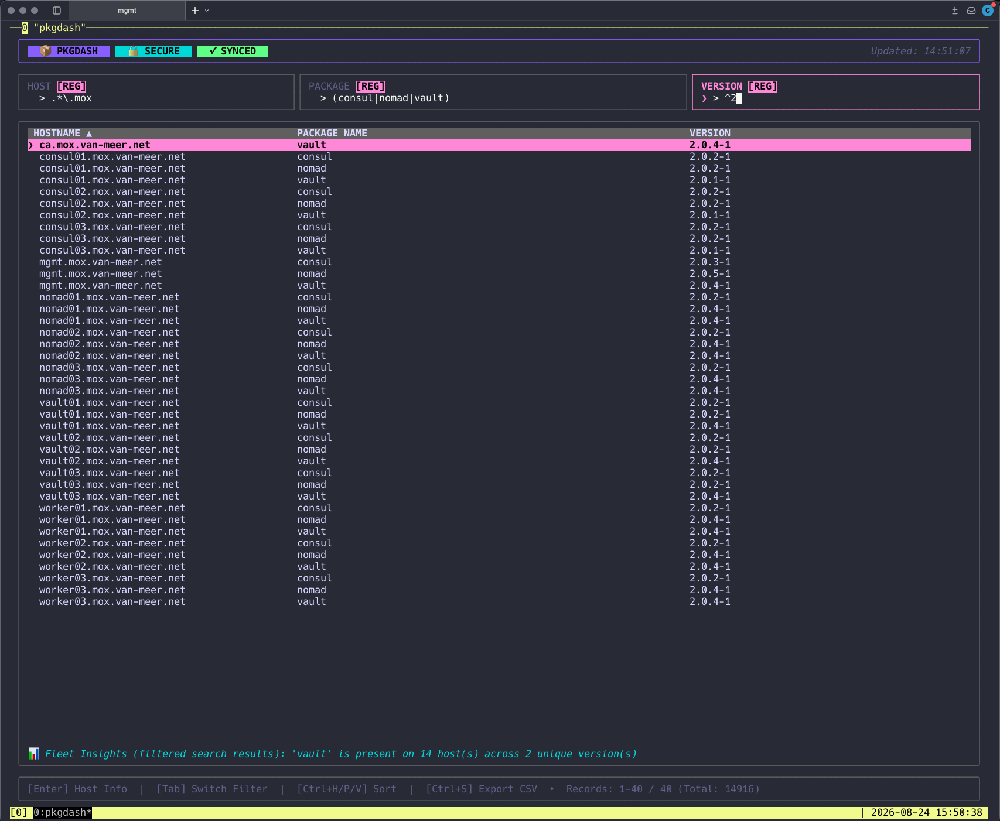

<p align="center">
  
</p>

# pkgdash

**pkgdash** is a high-performance, lightweight fleet package inventory dashboard built in Go. It consists of an HTTP/HTTPS daemon (`pkgdashd`) that aggregates and serves server package inventories and an interactive Cyberpunk-themed Terminal UI client (`pkgdash`) powered by [Bubble Tea](https://github.com/charmbracelet/bubbletea).

---

## 📸 Screenshot

<p align="center">
  
</p>

---

## 🏗️ Architecture & Components

* **`pkgdashd` (Daemon):** An in-memory cached HTTP/HTTPS server that reads host inventory JSON files (typically generated by Ansible), compresses them on the fly, and serves them to clients with optional Pre-Shared Key (PSK) authentication, auto-generated TLS certificates, and systemd service integration.
* **`pkgdash` (TUI Client):** A rich terminal user interface for infrastructure engineers. Features multi-column Regex search, live streaming updates, column sorting, host detail inspection modals, fleet statistics, and CSV data exports.

---

## ⚡ Features

* **High Performance:** In-memory 2-second caching layer with Gzip pre-compression (<1ms response times).
* **Detailed Host Modals:** Press `Enter` on any package entry to view full host metadata (Hostname, IP Address, OS Distribution/Version, Host Function).
* **Regex-Enabled Search:** Real-time filtering across Hostname, Package Name, and Version columns.
* **Security First:** Built-in auto-TLS generation and PSK header authentication (`X-PSK`).
* **One-Command Service Setup:** Self-installing systemd integration built right into the daemon binary.
* **Data Export:** Export filtered inventory directly to CSV (`Ctrl+S`).

---

## 🚀 Installation & Building

Ensure you have **Go 1.20+** installed on your system.

```bash
# Clone the repository
git clone https://github.com/chrisvanmeer/pkgdash.git
cd pkgdash

# Install dependencies and build binaries
go build -o pkgdashd ./cmd/pkgdashd
go build -o pkgdash ./cmd/pkgdash
```

---

## ⚙️ Usage

### 1. Running the Daemon (`pkgdashd`)

The daemon monitors a directory containing JSON host inventories (e.g., `/tmp/pkgdash` or `/root/pkgdash_data`).

```bash
# Direct execution
./pkgdashd --port=":9876" --data-path="/<path_to>/pkgdash_data" --psk="your-secret-key" --tls

# Install as a background systemd service (runs automatically on boot)
sudo ./pkgdashd --install --port=":9876" --data-path="/<path_to>/pkgdash_data" --psk="your-secret-key" --tls

# Uninstall the systemd service
sudo ./pkgdashd --uninstall
```

**Daemon Flags:**

* `--port`: Port to listen on (default `:9876`).
* `--data-path`: Directory containing host `.json` files (default `/tmp/pkgdash`).
* `--psk`: Optional Pre-Shared Key for authentication.
* `--tls`: Enable auto-generated TLS encryption.
* `--install`: Install and enable systemd service unit.
* `--uninstall`: Stop, disable, and purge systemd unit and binary.

---

### 2. Running the TUI Client (`pkgdash`)

Configure target servers using environment variables or a configuration file.

#### Environment Variables

```bash
export PKGDASH_SERVERS="https://pkgdash.internal.domain:9876,192.168.1.50:9876"
export PKGDASH_PSK="your-secret-key"

./pkgdash
```

#### Configuration File

Alternatively, create `~/.local/pkgdash.config`:

```ini
# Servers to query
https://pkgdash.internal.domain:9876
192.168.1.50:9876

# Pre-Shared Key
psk=your-secret-key
```

Then run simply:

```bash
./pkgdash
```

---

## ⌨️ TUI Keybindings

| Keybinding              | Action                                                              |
| :---------------------- | :------------------------------------------------------------------ |
| `Enter`                 | Open host detail modal (Hostname, IP, OS, Function)                 |
| `Ctrl+D`                | Open Host Comparison (Diff) modal                                   |
| `Ctrl+T` (in Diff view) | Toggle between all packages and Diffs Only mode                     |
| `Ctrl+E`                | Export unique hostnames from search results to `temp_inventory.ini` |
| `Ctrl+S`                | Export current filtered view to `pkgdash_output.csv`                |
| `Tab` / `Shift+Tab`     | Cycle focus between Host, Package, and Version filter fields        |
| `Ctrl+H`                | Sort by **Hostname** (toggle Ascending/Descending)                  |
| `Ctrl+P`                | Sort by **Package Name** (toggle Ascending/Descending)              |
| `Ctrl+V`                | Sort by **Version** (toggle Ascending/Descending)                   |
| `Ctrl+C`                | Open About / Control Center modal                                   |
| `Esc`                   | Close modal / Exit dashboard                                        |

---

## 📦 Data Schema & Ansible Collector

`pkgdashd` expects JSON files in its `--data-path` folder matching the following structure:

```json
[
  {
    "hostname": "srv-web-01.internal",
    "ip_address": "10.0.0.15",
    "os_name": "Ubuntu",
    "os_version": "22.04",
    "host_function": "Web Application Firewall",
    "packages": [
      {
        "name": "nginx",
        "version": "1.18.0-0ubuntu1.4",
        "arch": "amd64"
      }
    ]
  }
]
```

### Sample Ansible Playbook

Use this Ansible snippet on your Control Node to generate inventory JSON files compatible with `pkgdashd`:

```yaml
---
- name: Collect installed packages and aggregate locally
  hosts: all
  gather_facts: true
  vars:
    pkgdash_path: /var/lib/pkgdash_data

  tasks:
    - name: Get host function from MOTD
      ansible.builtin.shell:
        cmd: "awk -F': *' '/[Ff]unction/ {print $2}' /etc/motd"
      register: function_result
      changed_when: false
      failed_when: false

    - name: Set host_function fact
      ansible.builtin.set_fact:
        host_function: "{{ function_result.stdout | default('') | trim }}"

    - name: Gather package facts
      ansible.builtin.package_facts:
        manager: auto

    - name: Ensure destination directory exists on control node
      ansible.builtin.file:
        path: "{{ pkgdash_path }}"
        state: directory
        mode: '0750'
      delegate_to: localhost
      run_once: true

    - name: Write aggregated JSON file
      ansible.builtin.copy:
        dest: "{{ pkgdash_path }}/{{ (inventory_file | basename | splitext | first) | default('default') }}.json"
        mode: '0640'
        content: >-
          
          
            
            
            
            
              
              
                
                  
                  
                
              
            
            
            
          
          {{ results | to_nice_json }}
      delegate_to: localhost
      run_once: true
```

---

## 📄 License

MIT License. Free for personal and commercial use.

---

## 👤 Author

Chris van Meer - <chris@atcomputing.nl>
